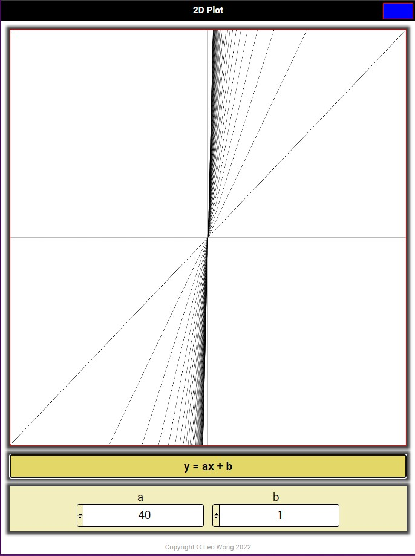

# 2D Plot

## Introduction

This was a personal challenge set by myself. I wanted to create an app that could draw simple lines.

## Deployed App

Go to [2d Plot](https://leoelicos.github.io/bcs-04-2d-plot) to play around with the 2d Plot

## Screenshots



## User Story

```
AS A programmer learning how to use Javascript
I WANT to make an app that can dynamically create an image
SO THAT I can visualise the output of a polynomial function
```

## Technical Requirements

```
GIVEN I need an app that generates an image of a polynomial graph
WHEN I view the app
THEN there will be a canvas where the graph is rendered
WHEN I view the app
THEN there will be a space below the canvas to change the parameters of the graph
WHEN I view the parameters of the polynomial
THEN there will be 5 parameters corresponding to the polynomial coefficients and a 6th parameter for a constant
WHEN I adjust the parameters of the polynomial
THEN I will be able to see the formula in the form of y = ax5 + bx4 + cx3 + dx2 + ex + f
WHEN I adjust the parameters of the graph
THEN I will be able to adjust the where the graph starts and ends on the x- and y- axes
WHEN I press the plot button
THEN the function will render on the canvas area
```

## Mockups

The rendered graph should have similarity in appearance to the mockup below:

### Graph of a 2d Plot


